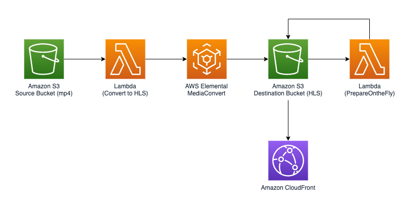
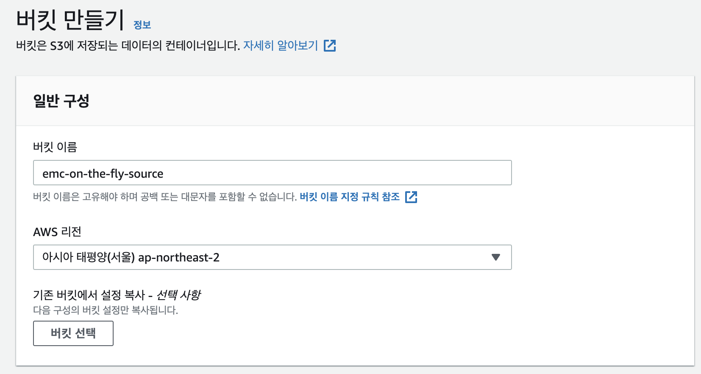

사용자는 mp4 등의 형식으로 되어 있는 동영상을 업로드하게 됩니다. 업로드된 원본 동영상을 담을 S3 버킷, 그리고 변환이 완료된 영상을 담을 S3 버킷을 생성합니다.

### S3 Bucket 생성하기

1. [S3 콘솔](https://console.aws.amazon.com/s3) 에 접속합니다.
1. "버킷 만들기" 버튼을 눌러 버킷 생성 페이지로 이동합니다.
1. 버킷 이름을 지정합니다. 워크샵에서는 "emc-on-the-fly-source" 라는 이름을 이용하지만, 진행 중에는 다른 이름을 선택합니다. 
1. 이하 설정은 그대로 두고, "버킷 만들기" 를 눌러 버킷을 생성합니다.
1. 위의 과정을 반복하여 새로운 S3 버킷을 생성합니다. 워크샵에서는 "emc-on-the-fly-destination" 이라는 이름을 사용합니다.

### 버킷 권한 설정하기
1. 결과 버킷 (워크샵에서는 emc-on-the-fly-destination)을 선택합니다.
1. "권한"을 누르고 스크롤을 가장 아래로 내려서 CORS 항목으로 이동합니다.
1. "편집"을 누르고 다음을 붙여넣기 합니다.
```
[
    {
        "AllowedHeaders": [
            "*"
        ],
        "AllowedMethods": [
            "GET",
            "HEAD"
        ],
        "AllowedOrigins": [
            "*"
        ],
        "ExposeHeaders": [
            "x-amz-server-side-encryption",
            "x-amz-request-id",
            "x-amz-id-2"
        ],
        "MaxAgeSeconds": 3000
    }
]
```

---
<p align="center">
© 2020 Amazon Web Services, Inc. 또는 자회사, All rights reserved.
</p>
