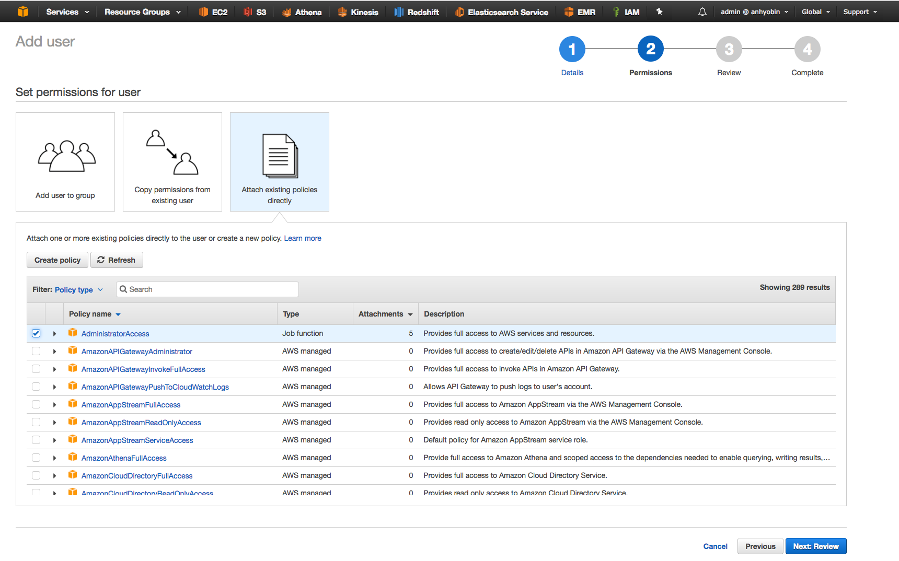
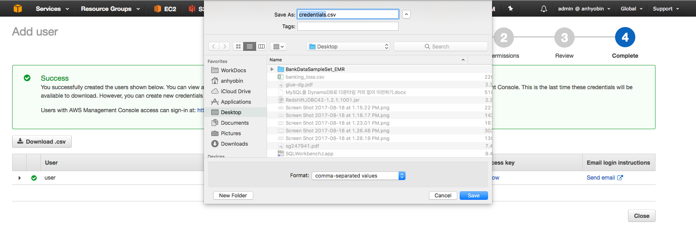
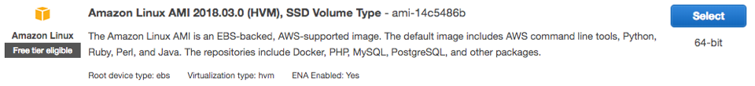
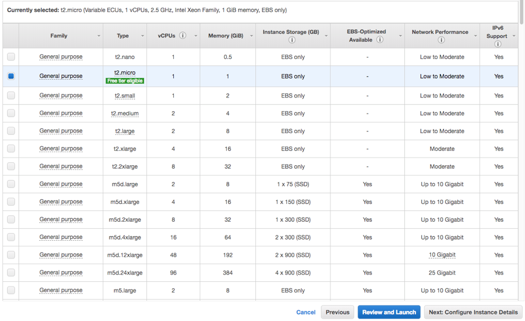
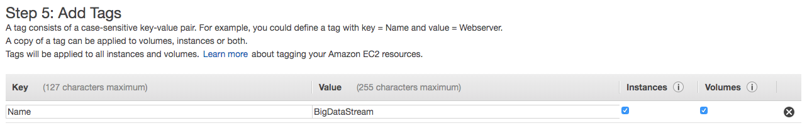
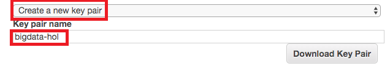
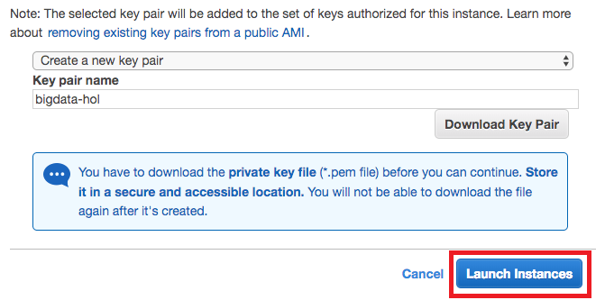

본격적인 Lab 시작에 앞서 구성에 필요한 IAM User, EC2, S3를 생성 및 구성합니다. Redshift 실습은 생략할 예정임으로 DBeaver는 설치하실 필요가 없습니다.<br/><br/>

#### IAM User 생성
Lab 전체에서 사용할 IAM User를 생성합니다.<br/>

1. AWS Management Console에 로그인 한 뒤 **IAM** 서비스에 접속합니다.
2. 왼쪽 메뉴에서 **Users**를 선택합니다.

3. **Add user** 버튼을 클릭하여 사용자 추가 페이지로 들어갑니다.
4. **User name**에 **<원하는 사용자 이름>** 을 입력하고, **Access type**에 **Programmatic access**와 **AWS Management Console access** 둘 모두를 선택합니다. **Console password**에 **<원하는 패스워드>**를 입력하고, 마지막 **Require password reset**의 체크는 **해제**합니다.


5. **Next: Permissions** 버튼을 클릭하고 **Attach existing policies directly**를 선택한 뒤 **AdministratorAccess** 권한을 추가해줍니다.

6. **Next: Review** 버튼을 클릭하고 정보를 확인한 뒤 **Create user** 버튼을 클릭하여 사용자 생성을 완료합니다.

7. **Download.csv** 버튼을 클릭하여 생성한 사용자의 정보를 다운 받습니다. EC2 설정에 꼭 필요한 파일이므로 기억하기 쉬운 위치에 저장합니다.


#### EC2 생성
Lab에서 데이터를 실시간으로 발생시킬 EC2 인스턴스를 생성합니다.<br/>

1. AWS Management Console에서 **EC2** 서비스에 접속합니다.
2. 우측 상단에서 Region은 **US East (N. Virginia)**를 선택합니다.
3. **Launch Instance**를 선택하여 새로운 인스턴스 생성을 시작합니다.

4. **Step 1: Choose an Amazon Machine Image (AMI)** 화면에서 **Amazon Linux AMI 2018.03.0 (HVM), SSD Volume Type - ami-14c5486b** 를 선택합니다.

5. **Step 2 : Choose an Instance Type** 화면에서 인스턴스 타입은 **t2.micro**를 선택합니다. **Next: Configure Instance Details** 을 클릭합니다.

6. **Step 3: Configure Instance Details** 화면에서 **Advanced Details**을 클릭하고 아래 **userdata**를 복사하여 붙여 넣습니다.
``` markup
#include
https://s3.amazonaws.com/immersionday-bigdata-v20180731/userdata.sh
```

7. **Step 4: Add Storage** 화면에서 기본값을 그대로 두고 **Next: Add Tags**를 클릭합니다.
8. **Step 5: Add Tags** 화면에서 **Add Tag** 버튼을 한 번 클릭한 뒤, **Key/Value** : **Name/BigDataStream** 를 입력하고 **Next: Configure Security Group** 을 클릭합니다.

9. **Step 6: Configure Security Group** 화면에서 **Security Group에 필요한 정보를 입력**한 후 **Review and Launch**를 클릭합니다.
    * Security Group Name : bastion
    * Description : SG for bastion
    * Type : SSH
    * Protocol : TCP
    * Port Range : 22
    * Source : 0.0.0.0/0

10. **Step 7: Review Instance Launch** 화면에서 **Launch**를 클릭합니다.
11. EC2 Instance에 접속하기 위한 Key pair를 생성합니다. **Create a new key pair**를 선택하고 **Key pair name**은 **bigdata-hol** 을 입력한 후 **Download Key Pair**를 클릭합니다.

12. **Key Pair**를 **PC의 임의 위치에 저장**한 후 **Launch Instances**를 클릭합니다. (인스턴스 기동에 몇 분이 소요될 수 있습니다.)

13. (MacOS 사용자) 다운로드 받은 **Key Pair 파일의 File Permission**을 **400**으로 변경합니다.
``` markup
$ chmod 400 ./bigdata-hol.pem
$ ls -lat bigdata-hol.pem
-r-------- 1 ****** ****** 1692 Jun 25 11:49 bigdata-hol.pem
```

#### EC2 설정
생성한 EC2 인스턴스가 다른 AWS 리소스에 접근 및 제어할 수 있도록 다음과 같이 구성합니다.<br/>

1. 생성한 인스턴스의 Public IP로 SSH 접속을 합니다.
``` markup
ssh -i “<Key pair name>" ec2-user@<Public IP>
```

**&nbsp;* Windows OS를 사용하시는 경우 Putty를 이용하여 접속합니다.**
2. User Data를 통해 3가지 파일(banking_loss.csv, firehose.py, redshift.py)이 잘 다운로드 받아졌는지 확인합니다.
``` markup
ls
```

3. AWS의 다른 리소스 접근을 위해 AWS Configure를 진행합니다. 이때 앞서 생성한 IAM User 데이터를 활용합니다. 이전에 다운로드 받은 .csv 파일을 열어 Access key ID와 Secret access key를 확인하고 입력합니다.
``` markup
aws configure
AWS Access Key ID [None]: <Access key ID>
AWS Secret Access Key [None]: <Secret access key>
Default region name [None]: us-east-1
Default output format [None]:
```

4. 설정이 완료 되었다면 다음과 같이 입력하신 정보가 마스킹 되어 보이게 됩니다.


#### S3 Bucket 생성
발생한 실시간 데이터를 저장할 S3 Bucket을 생성합니다.<br/>

1. AWS Management Console에서 **S3** 서비스에 접속합니다.
2. **Create bucket** 버튼을 클릭하고 다음과 같은 정보를 입력한 뒤 **Create** 버튼을 클릭하여 bucket을 생성합니다.

| &nbsp; | &nbsp; |
| ------ | ------ |
| Bucket name | bigdata-immersionday-**[개인식별자]** <br/> (예 : bigdata-immersionday-**foobar**) |
| Region | US East (N. Virginia) |
| 그 외 | default |

---
<p align="center">
© 2019 Amazon Web Services, Inc. 또는 자회사, All rights reserved.
</p>