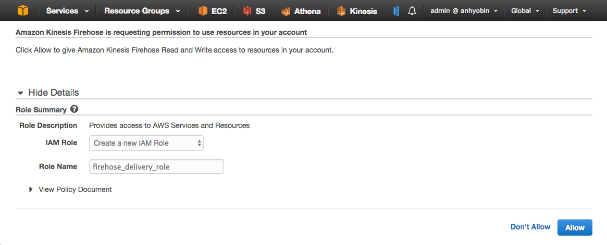
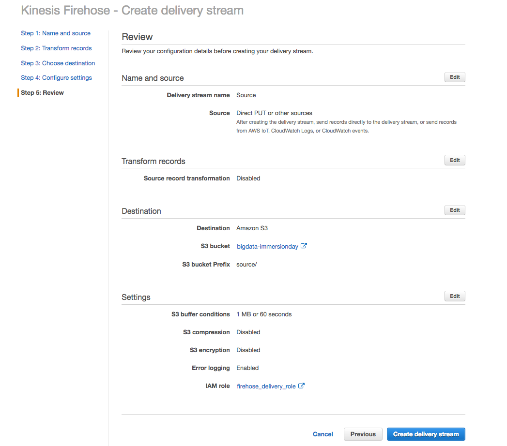
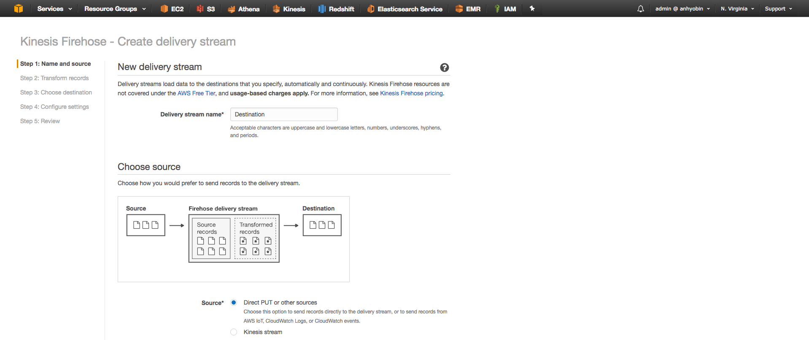
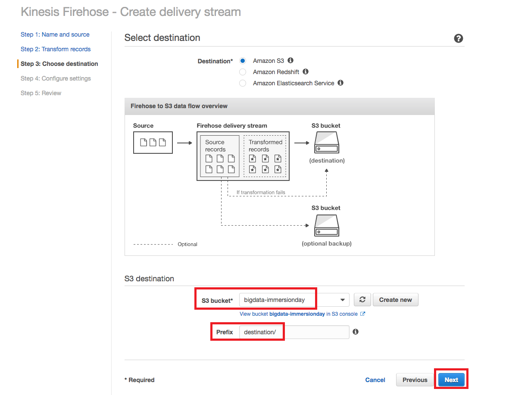
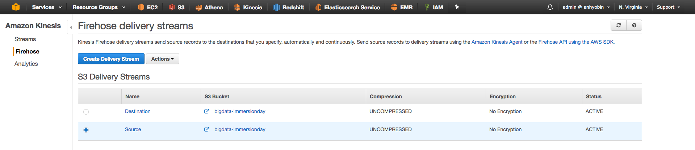
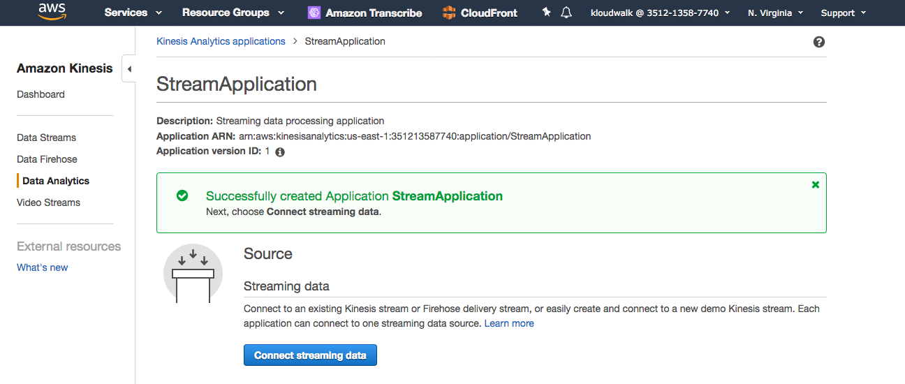
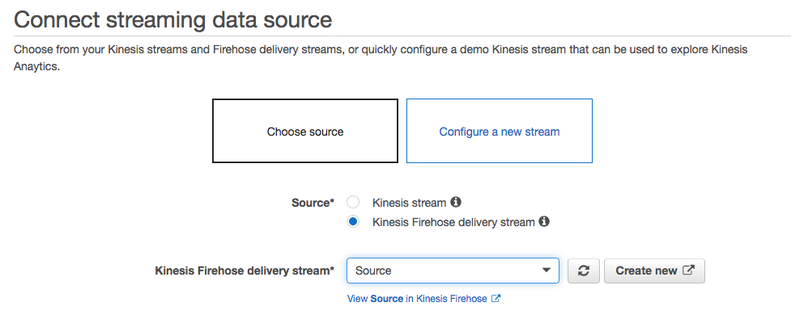
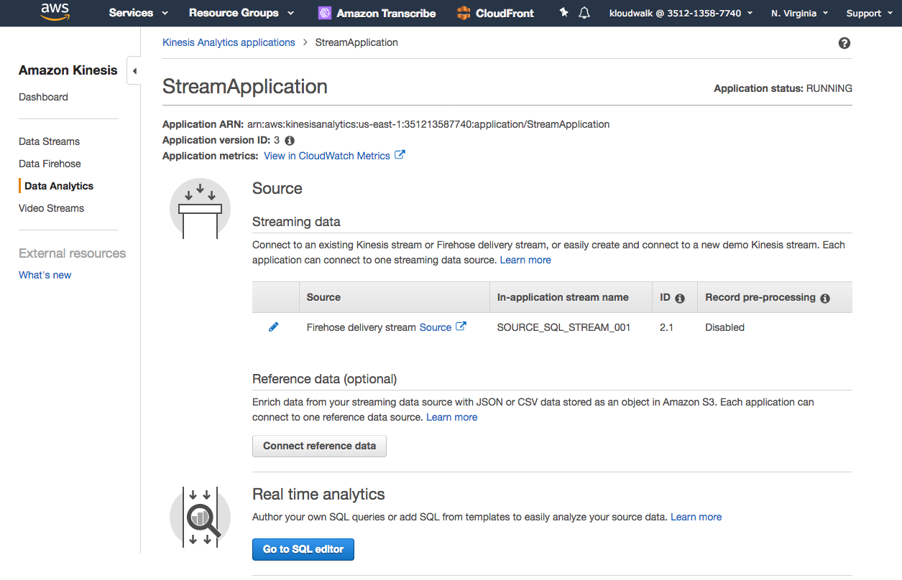
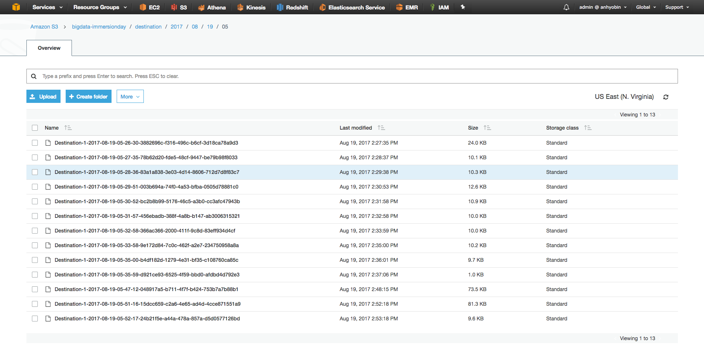

#### Lab 설명
이번 Lab은 EC2에서 발생하는 데이터를 Kinesis Firehose를 통해 **수집**하여 S3에 **저장**합니다. 그 후 Kinesis Analytics로 실시간 쿼리해 **분석**해보고, 결과를 S3에 다시 **저장**합니다.

#### Lab Architecture


#### Kinesis Firehose 생성 (원본 데이터)
Kinesis Firehose를 통해 앞서 생성한 EC2가 발생시키는 실시간 데이터를 S3, Redshift, ElasticSearch 등의 목적지에 수집할 수 있습니다.<br/>

1. AWS Management Console에서 **Kinesis** 서비스를 선택합니다. (Region : N.Virginia)
2. **Get Started** 버튼을 클릭합니다.
3. **Deliver streaming data with Kinesis Firehose delivery streams** 메뉴의 **Create delivery stream** 을 클릭하여 새로운 Firehose 전송 스트림 생성을 시작합니다.

4. **Delivery stream name**에 **Source** 를 입력한 뒤 **Next**를 클릭합니다.<br/>
(주의 : Source 이외의 name을 지정할 경우 EC2에서 Kinesis Firehose로 log가 전송되지 않습니다.)
5. **Record transformation** / **Record format conversion** 은 default인 Disabled로 두고 **Next**를 클릭합니다.
6. **Destination**은 Amazon S3를 선택하고 아래 **S3 bucket**은 앞서 생성한 **bucket**을 선택합니다. **Prefix**에는 source/ 를 입력합니다. **Next**를 클릭합니다

7. **Buffer size**는 1MB, **Buffer interval**은 60 seconds로 설정합니다.
8. 아래 **IAM role**에서 **Create new, or Choose** 버튼을 클릭합니다.

9. 새로 열린 탭에서 필요한 정책이 포함된 IAM 역할 **firehose_delivery_role**을 자동으로 생성합니다. **Allow** 버튼을 클릭하여 진행합니다.

10. 새롭게 생성된 역할이 추가된 것을 확인한 뒤 **Next** 버튼을 클릭합니다.

11. Review에서 입력한 정보를 확인한 뒤 틀린 부분이 없다면 **Create delivery stream** 버튼을 클릭하여 Firehose 생성을 완료합니다.

12. **Firehose delivery streams** 가 생성 되었습니다.


#### 데이터 수집 확인
생성한 Firehose가 정상적으로 데이터를 수집하는지 확인해봅니다.<br/>

1. 앞서 생성한 EC2 인스턴스에 SSH 접속을 합니다.
2. firehose.py 를 실행합니다.

``` markup
python firehose.py
```

3. 매 초 데이터가 발생하는 것을 확인합니다. 충분한 데이터 수집을 위해 실행 중인 상태로 다음 단계를 진행합니다.
4. 몇 분 뒤 생성한 S3 bucket에 가보면 생성된 원본 데이터가 Firehose를 통해 S3에 저장되는 것을 확인할 수 있습니다. 이 때 지정한 Prefix인 source 폴더에 데이터가 저장됩니다.


#### Kinesis Firehose 생성 (아웃풋 데이터)
앞서 생성한 Firehose 전송 스트림과 동일한 방법으로 Destination 전송 스트림을 생성합니다. 이 때, Delivery stream name과 S3 destination의 Prefix만 새로운 값을 입력합니다.<br/>

1. **Delivery stream name**에 Destination 를 입력한 뒤 **Next**를 클릭합니다.

2. **Destination**은 Amazon S3를 선택하고 아래 **S3 bucket**은 앞서 생성한 bucket을 선택합니다. **Prefix**에는 destination/ 을 입력합니다. **Next**를 클릭합니다.

3. **Buffer size**는 1MB, **Buffer interval**은 60 seconds로 설정합니다.
4. **IAM Role**은 앞서 생성된 firehose_delivery_role을 선택합니다. **Policy Name**은 Create a new Role Policy를 선택합니다.

5. Source, Destination 2개의 Firehose 전송 스트림 생성을 완료합니다.


#### Kinesis Analytics Application - 생성
Kinesis Analytics를 활용하여 스트리밍 데이터를 처리할 application을 생성합니다.<br/>

1. AWS Management Console에 로그인 한 뒤 **Kinesis** 서비스에 접속합니다.
2. **Kinesis analytics applications** 의 **Create analytics application**을 선택합니다.

3. **Application name**에 **StreamApplication**을 입력하고 **Create application** 버튼을 클릭합니다.


#### Kinesis Analytics Application - Source 지정
1. 생성한 application 화면으로 이동 후 **Connect streaming data** 버튼을 클릭합니다.

2. **Source**는 **Kinesis Firehose delivery stream** 을 선택하고 앞서 생성한 2개의 스트림 중 **Source** 를 선택합니다. **[Discover Schema]** 버튼을 클릭하여 Schema를 분석합니다. Schema 분석 후 아래에 샘플 데이터를 보여줍니다. (Schema 탐색이 실패했다면 EC2 인스턴스에서 firehose.py 가 실행 중 인지 확인합니다)


3. Schema분석이 끝나면 DATE 데이터 타입을 지정해주기 위해 **Edit schema** 버튼을 클릭합니다.

4. **OccurrenceStartDate**와 **DiscoveryDate**의 타입을 **DATE**로 변경해줍니다. **NetLoss**, **RecoveryAmount**, **EstimatedGrossLoss**는 **DOUBLE**로 변경해줍니다. **Save schema and update stream samples** 버튼을 클릭하여 저장합니다.

5. 저장이 완료되면 **Exit(done)** 버튼을 클릭한 뒤, **Save and continue** 버튼을 클릭하여 Source 지정을 완료합니다.


#### Kinesis Analytics Application - SQL 실시간 쿼리
1. **Go to SQL editor** 메뉴로 이동합니다.

2. Text editor에 다음과 같은 SQL문을 입력한 뒤 **Save and run SQL** 버튼을 클릭합니다. (이 때 Source data가 없다는 문구가 표시된다면 EC2에서 firehose.py가 실행 중인지 확인 후 Refresh 합니다.)

``` markup
CREATE OR REPLACE STREAM "DESTINATION_SQL_BASIC_STREAM" (
    Region VARCHAR(16), 
    Business VARCHAR(32), 
    Name VARCHAR(16), 
    Status VARCHAR(16), 
    RiskCategory VARCHAR(64), 
    RiskSubCategory VARCHAR(64),
    DiscoveryDate DATE, 
    OccurrenceStartDate DATE, 
    NetLoss DOUBLE,
    RecoveryAmount DOUBLE, 
    EstimatedGrossLoss DOUBLE);

CREATE OR REPLACE PUMP "STREAM_PUMP_1" AS 
    INSERT INTO
        "DESTINATION_SQL_BASIC_STREAM"
    SELECT STREAM "Region", "Business", "Name", "Status", "RiskCategory", "RiskSubCategory", "DiscoveryDate", "OccurrenceStartDate", "NetLoss", "RecoveryAmount", "EstimatedGrossLoss" 
    FROM SOURCE_SQL_STREAM_001";
```

3. SQL 쿼리가 실시간으로 수행되는 것을 확인할 수 있습니다. **Close** 버튼을 클릭합니다.


#### Kinesis Analytics Application - Destination 지정
1. Kinesis Analytics의 SQL 수행 결과를 S3에 저장할 수 있습니다. Kinesis Analytics StreamApplication 화면으로 돌아가 Connect to a destination 을 클릭합니다.

2. 
    * Destination : Kinesis Firehose delivery stream
    * Kinesis Firehose delivery stream : Destination
    * In-application stream name : DESTINATION_SQL_BASIC_STREAM,
    * Output format : JSON
    * Access to chosen resources : Create
    * update IAM role kinesis-analytics-StreamApplication-us-east-1 
을 지정한 후 Save and Continue 버튼을 클릭합니다.

3. **Destination**이 설정 되었습니다. **Exit to Kinesis Analytics applications** 을 클릭합니다.

4. EC2에서 firehose.py 실행을 중단했다면 다시 실행합니다.
5. 몇 분 뒤 S3 bucket을 보면 설정한 Prefix인 destination 폴더가 생성된 것을 확인할 수 있습니다. 해당 폴더에는 설정한대로 JSON 포맷으로 데이터가 수집됩니다.



---
<p align="center">
© 2019 Amazon Web Services, Inc. 또는 자회사, All rights reserved.
</p>