#### 실습 소개
이번 실습에서는 이전 시간에 진행한 실습에서 Kinesis Firehose로 S3에 저장한 데이터를 Glue, Athena, QuickSight 를 이용해 분석해봅니다.

#### 실습 아키텍처


#### AWS Glue
AWS Glue는 완전관리형 ETL(Extract, Transform, Load) 엔진입니다. 실습에서는 AWS Glue로 Kinesis Firehose가 S3에 저장한 데이터를 크롤링하여 Hive 호환 External Table을 만들고 Athena, QuickSight로 데이터를 분석하고 시각화 합니다.<br/>

1. AWS Glue에서 ETL Job을 수행하기 위해서는 특정 IAM 역할이 필요합니다. **IAM** 서비스에 접속합니다. https://console.aws.amazon.com/iam
2. 좌측 메뉴에서 **정책**을 클릭하고 {}정책 생성{} 버튼을 클릭합니다.
3. **정책 생성** 화면에서 **JSON** 탭을 클릭하고 아래 Policy를 복사하여 붙여 넣고 {}정책 검토{}를 클릭합니다.

``` markup
{
    "Version": "2012-10-17",
    "Statement": [
        {
            "Action": [
                "s3:*",
                "ec2:*",
                "iam:*",
                "glue:*",
                "logs:*"
            ],
            "Resource": "*",
            "Effect": "Allow"
        }
    ]
}
```
4. 정책 검토 화면에서 **이름**은 **GluePolicy**를 입력하고 {}정책 생성{} 버튼을 클릭합니다.
5. 좌측 메뉴에서 **역할**을 클릭하고 {}역할 만들기{} 버튼을 클릭합니다.
6. **이 역할을 사용할 서비스 선택** 에서 **Glue**를 클릭하고 {}다음: 권한{} 버튼을 클릭합니다.
7. **검색** 입력창에 방금 만든 **GluePolicy**를 입력하고 **GluePolicy**를 선택하고 {}다음: 태그{} 버튼을 클릭합니다.
8. 태그 추가 화면에서 {}다음: 검토{} 버튼을 클릭합니다
9. 검토 화면에서 **역할 이름**은 **GlueRole**을 입력하고 {}역할 만들기{} 버튼을 클릭합니다.
10. 좌측 역할 을 클릭하고 **GlueRole**이 정상적으로 생성되었는지 확인합니다.
11. AWS Glue (https://console.aws.amazon.com/glue) 로 이동합니다. 이전 실습에서 생성한 S3내 source 폴더 아래 파일 들을 크롤링하여 메타스토어 테이블을 만듭니다.<br/>
**데이터 카탈로그** > **데이터베이스** 를 클릭하고 {}데이터베이스 추가{} 를 클릭합니다.

12. **데이터베이스 이름** 은 **Immersion Day** 를 입력하고 {}생성{} 버튼을 클릭합니다.
13. **데이터 카탈로그** > **데이터베이스** > **테이블** 을 클릭하고 {}테이블 추가{} > **크롤러를 사용하여 테이블 추가** 를 클릭합니다.
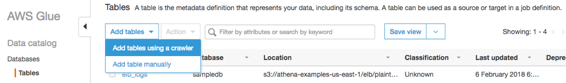
14. 크롤러 이름에 **TestCrawler** 입력 후 {}다음{} 을 클릭합니다.
15. Crawler source type에 **Data stores** 를 선택 후, {}다음{} 을 클릭합니다.
16. 크롤링 할 S3 버킷 및 폴더를 지정합니다. 포함 경로 에 **s3://bigdata-immersionday-[개인식별자]/source** 을 입력하거나 탐색기 버튼을 클릭하여 **bigdata-immersionday-[개인식별자]** 버킷 아래 **source** 폴더를 {}선택{} 한 후 {}다음{} 을 클릭합니다.
17. 다른 데이터 스토어 추가는 **아니요**를 선택하고 {}다음{} 을 클릭합니다.
18. **IAM 역할 선택** 화면에서 **기존 IAM 역할 선택**을 선택하고 앞서 생성한 **GlueRole**을 선택한 후 {}다음{} 을 클릭합니다.
19. 크롤러는 온디맨드 방식으로도 실행할 수 있고, 배치 방식으로도 실행할 수 있습니다. 실습에서는 온디맨드 방식으로 실행합니다. 빈도는 **온디맨드 실행**을 선택하고 {}다음{} 을 클릭합니다.
20. 데이터베이스는 앞서 생성한 **Immersion Day**를 선택한 후 {}다음{} 을 클릭합니다.
21. 크롤러 설정을 모두 확인한 후 {}마침{} 을 클릭합니다.
22. 데이터 카탈로그 > 크롤러 에서 생성한 TestCrawler를 선택한 후 {}크롤러 실행{} 을 클릭합니다.

23. 크롤러는 S3에 저장된 파일을 분석하고 테이블을 생성합니다. 크롤링이 끝난 후 테이블 1개 (테이블명 : **source**)가 생성되었음을 확인합니다.
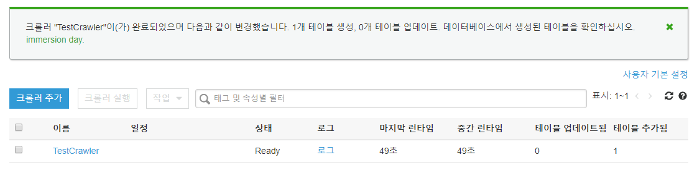
24. **데이터베이스** > **테이블** 에서 방금 생성된 **source** 테이블을 클릭하여 테이블 구조를 확인합니다.
25. Kinesis Firehose가 **s3://bigdata-immersionday-[개인식별자]/source** 에 저장한 JSON 파일 포맷 스트림 데이터를 Parquet 파일 포맷으로 변경하고, 일부 컬럼의 데이터 타입을 변경한 후 **s3://bigdata-immersionday-[개인식별자]/parquet** 폴더에 파일을 저장하는 Glue ETL 작업을 생성하겠습니다.
26. 우선 ETL후 결과 파일이 저장될 폴더를 생성합니다. S3 콘솔로 로그인한 후 **bigdata-immersionday-[개인식별자]** 버킷를 선택하고 **parquet** 폴더를 생성합니다.
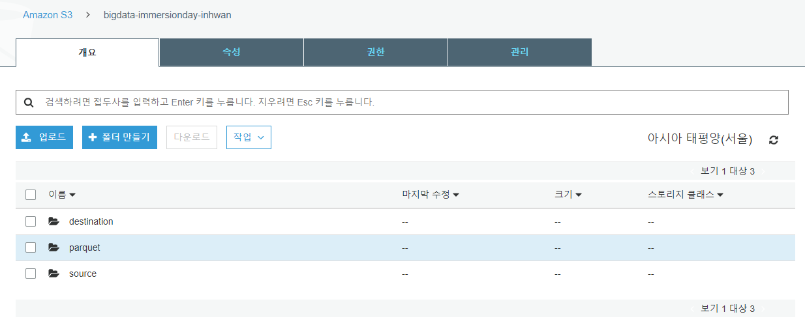
27. Glue 콘솔(https://console.aws.amazon.com/glue) 에서 **ETL** > **작업**을 선택한 후 {}작업 추가{} 를 클릭합니다.
28. **작업 속성 구성** 화면에서 **이름**은 **TestJob**을 입력하고, IAM 역할은 앞서 생성한 **GlueRole**을 선택합니다. **고급 속성** 에서 **작업 북마크**를 **활성화**하여 Glue가 마지막으로 처리한 데이터를 기억하게 합니다. {}다음{} 을 클릭합니다.
29. **데이터 원본 선택** 화면에서 **source**를 선택하고 {}다음{} 을 클릭합니다.
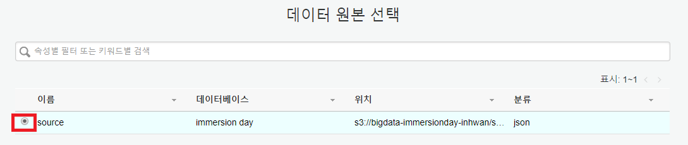
30. **데이터 대상 선택** 화면에서 **데이터 대상에서 테이블 생성**을 선택하고 **데이터 스토어**는 **Amazon S3**, **형식**은 **Parquet**, **대상 경로**는 **s3://bigdata-immersionday-[개인식별자]/parquet** 을 입력합니다. {}다음{} 을 클릭합니다.
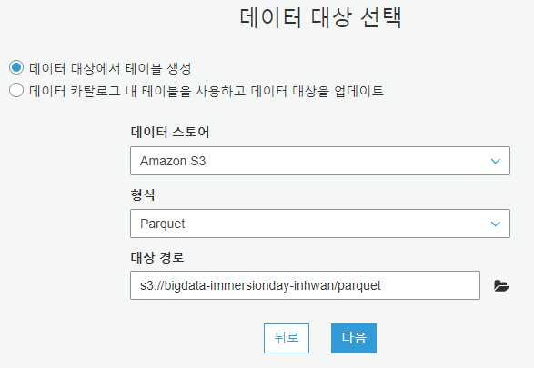
31. **occurencestartdate**, **discoverydate** 컬럼의 데이터 형식을 date로 변경한 후 {}작업 저장 및 스크립트 편집{} 을 클릭합니다.

32. 스크립트 내용을 검토한 후 상단의 {}작업 실행{} 버튼을 클릭하여 ETL을 시작합니다. 작업 완료까지 수 분이 소요될 수 있습니다.
33. Glue ETL 작업이 끝나면 **s3://bigdata-immersionday-[개인식별자]/parquet** 폴더에 **parquet** 타입 파일이 생성됩니다.
34. Glue ETL이 변환한 Parquet 파일을 크롤링하여 테이블을 생성합니다. **AWS Glue** > **크롤러** > **TestCrawler**를 선택하고 **작업** > **크롤러 편집** 를 선택합니다.

35. **크롤러 정보 추가** 화면에서 {}다음{} 을 클릭합니다.
36. **Specify crawler source type** 화면에서 {}다음{} 을 클릭합니다.
37. **데이터 스토어 추가** 화면에서 {}다음{} 을 를 클릭합니다.
38. **다른 데이터 스토어 추가** 화면에서 **예**를 선택한 후 {}다음{} 을 클릭합니다.
39. **데이터 스토어 추가** 화면에서 포함 경로에 **s3://bigdata-immersionday-[개인식별자]/parquet** 을 입력한 후 {}다음{} 을 클릭합니다.
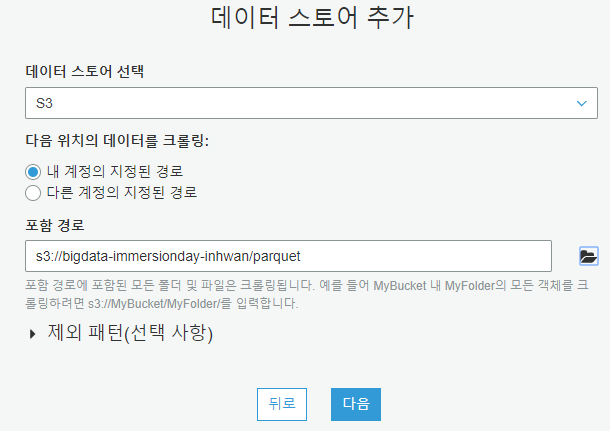
40. **다른 데이터 스토어 추가** 화면에서 {}다음{} 을 클릭합니다.
41. **IAM 역할 선택** 화면에서 {}다음{} 을 클릭합니다.
42. **이 크롤러의 일정 생성** 화면에서 {}다음{} 을 클릭합니다.
43. **크롤러의 출력 구성** 화면에서 {}다음{} 을 클릭합니다.
44. **리뷰** 화면에서 {}마침{} 을 클릭합니다.
45. **TestCrawler**를 선택하고 {}크롤러 실행{} 을 클릭합니다.

46. **크롤러** 실행 후 **parquet** 테이블이 생성됩니다.
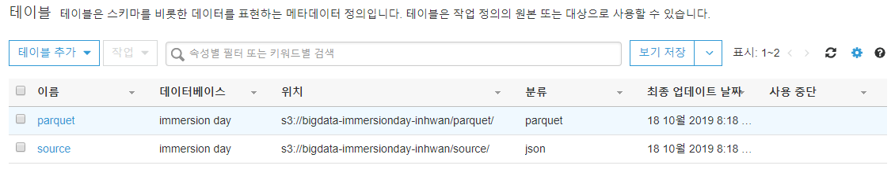

#### Amazon Athena
1. Athena를 이용하여 테이블 데이터를 조회할 수 있습니다. Glue 크롤러가 만든 **parquet** 테이블을 클릭하고 **작업** > **데이터 보기**를 클릭합니다.
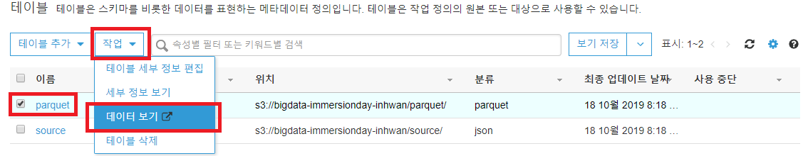
2. Athena 콘솔이 열리면, {}시작하기{} 를 클릭합니다.
3. set up a query result location in Amazon S3 를 클릭합니다.

4. 쿼리 결과 위치에 **s3://bigdata-immersionday-[개인식별자]/query-result/** 를 입력하고 {}저장{} 을 클릭합니다.
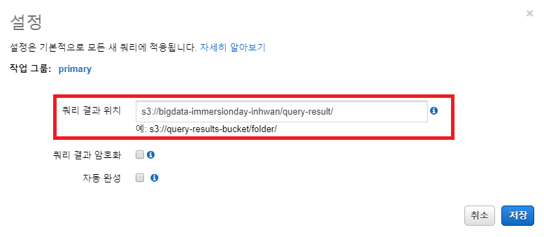
5. 다시 Glue 크롤러가 만든 **parquet** 테이블을 클릭하고 **작업** > **데이터 보기**를 클릭합니다.
6. Athena 콘솔이 열리고 아래 쿼리가 수행되었습니다.
```
SELECT * FROM "immersion day"."parquet" limit 10;
```
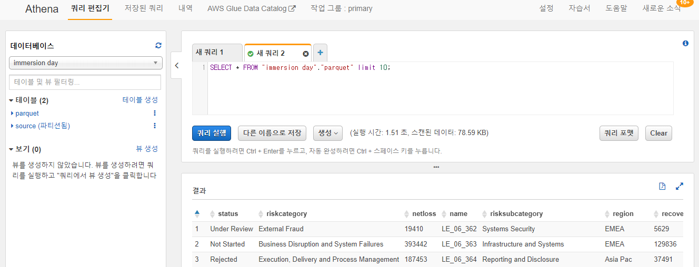
7. ANSI 표준 SQL문을 통해 S3내 데이터를 조회할 수 있습니다.

``` markup
SELECT region, status, count(*) as "COUNT"
FROM "immersion day"."parquet"
GROUP BY region, status
ORDER BY region;
```
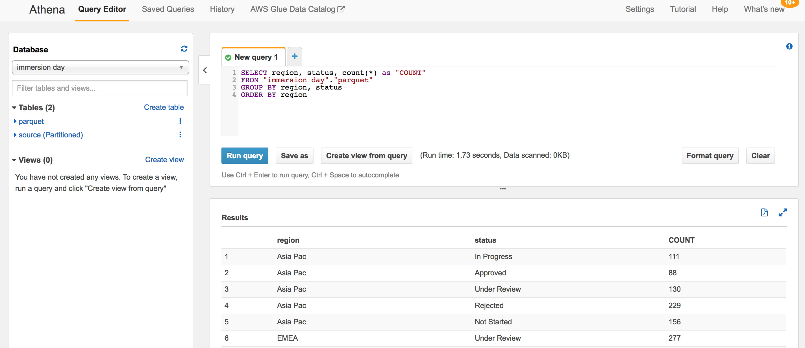

#### Amazon QuickSight
1. 이번에는 Amazon QuickSight를 통해 parquet 테이블 데이터를 시각화 해 보도록 하겠습니다. QuickSight 콘솔로 이동합니다. https://quicksight.aws.amazon.com
2. QuickSight에 가입하기 위해 {}Sign up for QuickSight{} 버튼을 클릭합니다.

3. **Standard** 에디션을 선택한 후 {}계속{}버튼을 클릭합니다.
4. **QuickSight 리전**은 **Asia Pacific (Seoul)**을 선택하고 **QuickSight 계정 이름**은 **임의로 지정(중복될 경우 계정이 생성되지 않습니다)** 하고 **알림 이메일 주소**는 개인 Email 주소를 입력합니다. QuckSight가 S3에 접근해야 하므로, **Choose S3 buckets**를 클릭하여 **bigdata-immersionday-[개인식별자]** 을 선택한 후 {}완료{} 를 클릭합니다.
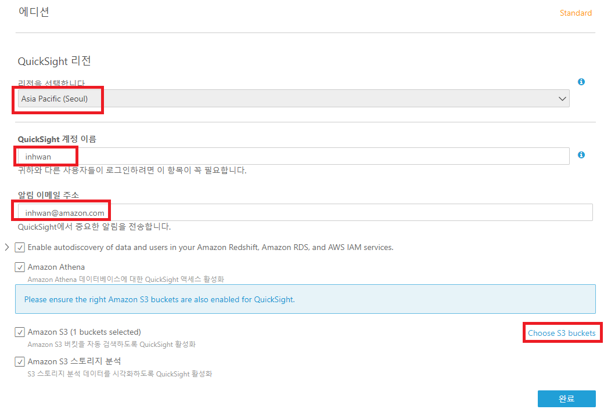
5. 계정이 생성된 후 {}Amazon QuickSight로 이동{} 버튼을 클릭합니다.
6. 좌측 상단 {}새 분석{} 을 클릭합니다.

7. {}새 데이터 세트{} 버튼을 클릭합니다.
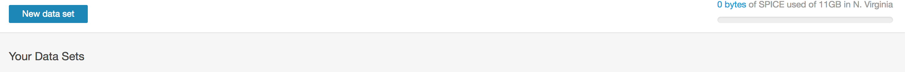
8. Athena를 클릭하고 팝업 창의 **데이터 원본 이름**에 **bigdata-quicksight**를 입력(임의의 값 입력 가능)하고 {}데이터 원본 생성{} 버튼을 클릭합니다.
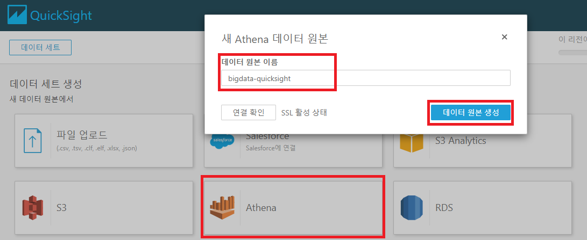
9. **테이블 선택**에서 **데이터베이스**는 **immersion day**, **테이블**은 **parquet**를 선택하고 {}선택{} 버튼을 클릭합니다.
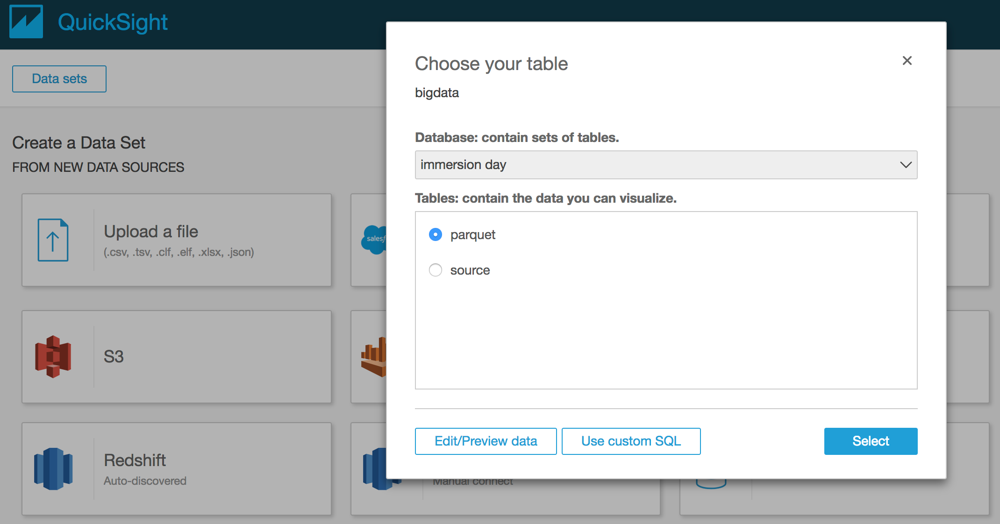
10. {}Visualize{} 버튼을 클릭한 후 parquet 테이블 데이터가 QuickSight SPICE 엔진에 로딩 되었는지 확인합니다.

11. 발생년도 별 Business 수를 시각화 해 보겠습니다. 좌측 **필드 목록**에서 **occurrencestartdate**, **business** 필드를 차례대로 클릭합니다. **시각적 객체 유형**은 **세로 막대 차트**를 선택합니다.

12. 그래프 하단 **occurrencestartdate** 를 클릭하고 **집계: 일**을 **년**으로 변경합니다.
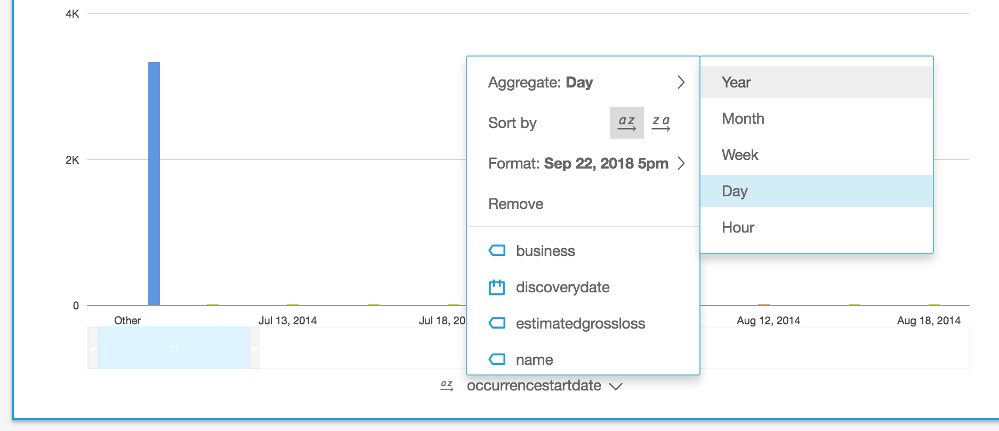
13. 연도별로 데이터가 집계 되었습니다.
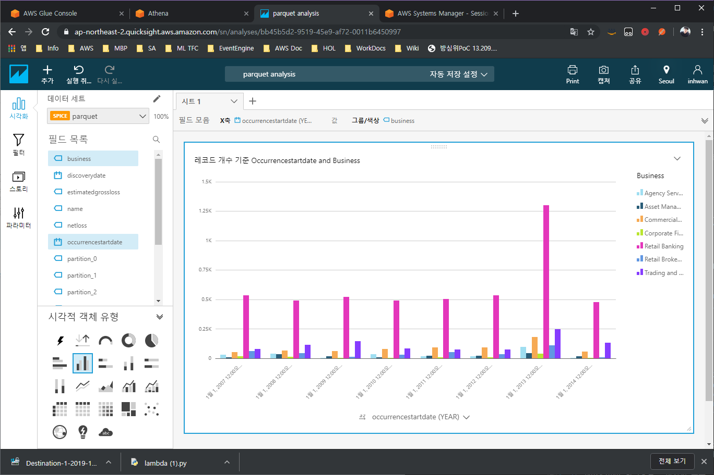
14. 방금 만든 대시보드를 다른 사용자에게 공유해 보겠습니다. 우측 상단 **사용자 아이콘**을 클릭하고 **QuickSight 관리**를 클릭합니다.
15. {}사용자 초대{} 버튼을 클릭한 후 **임의의 사용자 계정명(BI_user01**)을 입력한 후 우측 {}+{} 버튼을 클릭합니다. **이메일**은 **다른 사용자의 이메일 주소**를 입력하고 **역할**은 **작성자**, **IAM 사용자**는 **아니요**를 선택한 후 {}초대{} 버튼을 클릭합니다.

16. 사용자는 다음과 같은 초대 이메일을 받고 {}초대를 수락하려면 클릭하십시오{} 를 클릭하면 계정 생성 메뉴에서 비밀번호를 변경할 수 있습니다.

17. QuickSight 화면으로 돌아가서 우측 상단의 **공유** > **분석 공유**를 클릭합니다.

18. **BI_user01**을 선택한 후 {}공유{} 버튼을 클릭합니다.

19. 사용자는 다음과 같은 이메일을 수신합니다. {}Click to View{} 를 클릭하여 분석 결과를 확인할 수 있습니다.


---
<p align="center">
© 2019 Amazon Web Services, Inc. 또는 자회사, All rights reserved.
</p>
