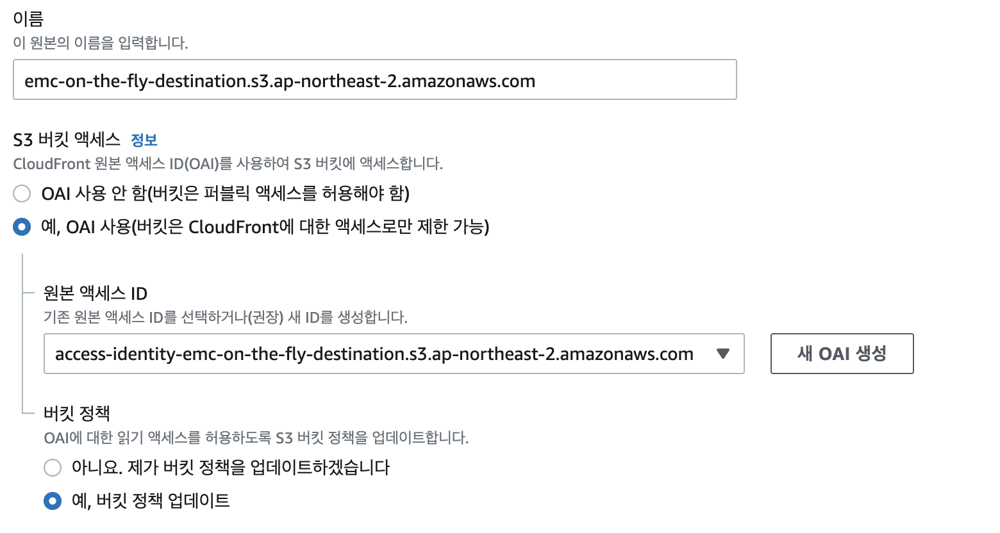
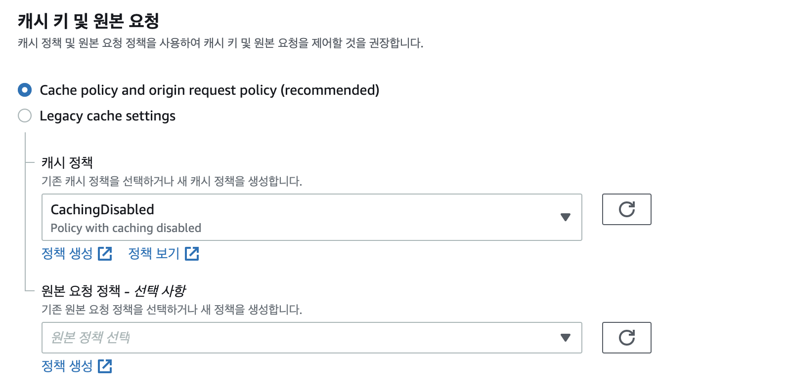

S3에 저장된 HLS 콘텐츠를 전달할 CloudFront 를 설정합니다.

### MediaConvert 작업 실행 함수
1. [CloudFront 콘솔](https://console.aws.amazon.com/cloudfront) 에 접속합니다.
1. "배포 생성"을 선택합니다.
1. 원본 도메인으로 결과 s3 버킷을 선택합니다.
1. S3 버킷 엑세스 에서 "예, OAI 사용" 을 선택하고, "새 OAI 생성" 을 선택합니다. "예, 버킷 정책 업데이트" 를 선택합니다. 
1. 캐시 정책에서 CachingDisabled 를 선택합니다.  
1. 배포 생성을 눌러 CloudFront 배포를 생성합니다.
1. 생성이 완료되면, 이후 사용을 위해서 "배포 도메인"을 복사합니다.

© 2020 Amazon Web Services, Inc. 또는 자회사, All rights reserved.

