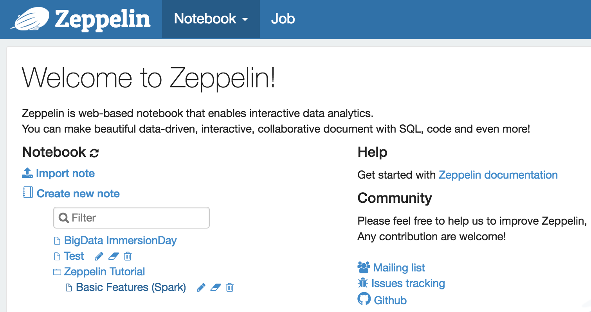

Amazon EMR은 관리형 Hadoop 프레임워크로서 빠르게 빅데이터 분석을 위한 Hadoop 클러스터 구성을 할 수 있습니다.<br/>

#### EMR 클러스터 생성
EMR 클러스터를 구성합니다. 본 실습에서는 Spark와 Zeppelin을 활용합니다.<br/>
1. AWS 관리 콘솔에 로그인 한 뒤, **Oregon** 리전의 **EMR** 서비스에 접속합니다.<br/>
2. {}클러스터 생성{} 버튼을 선택하여 클러스터 구성을 시작합니다.<br/>
3. **고급 옵션으로 이동** 버튼을 선택하여 원하는 애플리케이션을 직접 선택하여 구성합니다.<br/>

4. **Release**는 **emr-5.27.0**, 소프트웨어는 **Spark 2.4.4**과 **Zeppelin 0.8.1**를 선택하고 **"Hive 테이블 메타 데이터에서 사용"** 및 **"Spark 테이블 메타 데이터에서 사용"**을 선택합니다.

5. 하드웨어 구성 단계에서는 네트워크 선택에서 vpc-xxxxx 를 선택하고 EC2 서브넷에서는 가장 상단의 항목을 선택합니다. 나머지 항목은 그대로 두고 {}다음{} 을 클릭합니다.

6. **클러스터 이름**에 원하는 클러스터 이름을 입력하고, **종료 보호** 옵션은 체크 해제 합니다. {}다음{}을 클릭합니다.

7. **보안 옵션**에서 앞에서 생성한 **EC2 키 페어**를 선택합니다.

8. 다음과 같이 두 단계로 보안을 설정합니다.

    1 단계) EC2 보안 그룹섹션에서 마스터와 코어 및 작업의 EMR 관리형 보안 그룹에는 모두 각각 default 그룹을 설정하고
    
    2 단계) **마스터 노드의 추가 보안 그룹에는 사전 준비에서 생성했던 보안 그룹 (포트 22 허용)을 추가로 할당합니다.**
    
9. 화면 하단의 **클러스터 생성**을 선택하여 클러스터를 생성합니다.<br/>
EMR 클러스터 생성에 약 **10분~15분** 정도 소요됩니다.

10. 클러스터의 **상태**가 **대기 (클러스터 준비)**이 되면 다음 실습을 진행합니다.


#### EMR 웹 접속 설정 (윈도 운영체제)
1. 생성한 클러스터를 선택하여 마스터 퍼블릭 DNS 정보를 확인합니다.

2. **SSH**의 **Tunnels**에서 **Source port**에 8157을 **Destination**에는 localhost:8890 을 입력한 뒤 **Add**를 클릭합니다.

3. **Auth**에는 EMR 클러스터 생성시에 사용한 키 페어의 .ppk 키를 추가합니다.
4. 마지막으로 **Session**의 **Host Name**에는 다음을 입력한 뒤 **Open**을 클릭하여 접속합니다.
```
hadoop@<마스터 퍼블릭 DNS>
```


5. 브라우저에서 http://localhost:8157 주소로 접속합니다.


#### EMR 웹 접속 설정 (Mac 또는 Linux 운영체제)
1. 간단히 마스터 노드와의 SSH 터널을 만들어 접근할 수 있습니다.
2. 마스터 퍼블릭 DNS를 확인합니다.

3. 터미널에서 다음 명령어를 입력합니다. 응답을 반환 하지는 않습니다.
```
ssh -i "<키 페어 이름>" -N -L 8157:localhost:8890 hadoop@<마스터 퍼블릭 DNS>
```


4. 브라우저에서 http://localhost:8157 주소로 접속합니다.


#### Zeppelin을 활용한 빅데이터 분석
1. Zeppelin Tutorial - Basic Features (Spark)를 클릭합니다.

2. 여러분은 S3 (EMRFS)에 저장된 데이터(각 필드가 ‘;’로 구분)로 부터 6개의 컬럼을 읽어 필요한 자료형을 적용하고 이를 임시 테이블로 저장하는 코드를 볼 수 있습니다.

3. 원본 코드에서 추가로 몇몇 컬럼을 더 가져오기(6번째 12번째 컬럼을 추가로 활용) 위하여 https://github.com/setch3000/emr-s3/blob/master/sample.scala 에서 샘플 코드를 복사하여 Zepplelin 노트북의 셀에 붙여 넣기를 한 후 ▷버튼을 눌려 다시 한번 실행 해 봅니다.

```
%spark
import org.apache.commons.io.IOUtils
import java.net.URL
import java.nio.charset.Charset

//Load Bank Data
val bankText = sc.parallelize(
    IOUtils.toString(
        new URL("https://s3.amazonaws.com/apache-zeppelin/tutorial/bank/bank.csv"),
        Charset.forName("utf8")).split("\n"))
 
case class Order(age: Integer, job: String, marital: String, education: String, amount: Integer, housing: String, campaign: String)
 
val bank = bankText.map(s => s.split(";")).filter(s => s(0) != "\"age\"").map(
    s => Order(s(0).toInt,
            s(1).replaceAll("\"", ""),
            s(2).replaceAll("\"", ""),
            s(3).replaceAll("\"", ""),
            s(5).replaceAll("\"", "").toInt,
            s(6).replaceAll("\"", ""),
            s(12).replaceAll("\"", "")
        )
).toDF()
bank.registerTempTable("bank")
bank.show()
```
4. 로딩 된 데이터를 바탕으로 다양한 분석을 진행 해 봅니다.<br/>
4.1 결혼 여부 / 주택 소유 여부에 따른 평균 이용 금액
```
%sql
select marital,housing,
avg(amount)
from bank
group by marital, housing
```

4.2 직업별 평균 이용 금액
```
%sql
select job, avg(amount)
from bank
group by job
order by 2
```

4.3 20대 나이별 평균 이용 금액
```
%sql
select age, avg(amount)
from bank
where age > ${minAge=19} and
age < ${maxAge=30}
group by age
```

4.4 연령/교육 수준별 이용 금액
```
%sql
select age, amount, education,
housing
from bank
```

4.5 직업 별 평균 마케팅 노출 횟수
```
%sql
select job, avg(campaign) as
campaign
from bank
group by job
```

4.6 결혼 직업 별 이용 금액 합계
```
%sql
select marital, job, sum(amount)
from bank
group by marital, job
```

5. 분석 결과를 그래프로 표현 하면 아래와 같이 원하는 정보를 같은 방식으로 분석할 수 있습니다.


#### Glue 데이터 카탈로그를 활용하여 S3에 저장된 데이터 분석
EMR 클러스터에서 Glue의 카탈로그를 조회하여 손쉽게 S3에 저장된 데이터를 분석 할 수 있습니다.<br/>
1. 화면 좌측 상단의 Zeppelin 이미지를 클릭하여 Zeppelin의 첫페이지로 이동합니다.<br/>
2. Create new note 버튼을 클릭 합니다.

3. ’TEST’라는 이름으로 새 노트를 생성 합니다.

4. Glue의 카탈로그를 조회하여 데이터베이스 리스트를 확인 합니다.
```
%spark
spark.sql("show databases").show()
```

5. 확인된 데이터베이스 리스트 중 "workshop"의 테이블들을 확인해 봅니다.
```
%spark
spark.catalog.setCurrentDatabase("workshop")
spark.sql("show tables").show()
```

6. 다음과 같이 쿼리를 수행하여 데이터 분석을 진행 합니다.
```
%sql
select region, status, count(*)
from parquet
group by region, status
order by region
```


#### 선택 작업 : EMR 클러스터에 노드 추가
EMR 클러스터에서 Hadoop의 슬레이브 노드에 해당하는 작업을 실행하는 Core 노드와 Task 노드를 쉽게 추가할 수 있습니다.<br/>
1. AWS 관리 콘솔에 로그인 한 뒤, **EMR** 서비스에 접속합니다.<br/>
2. 생성한 클러스터를 선택한 후, 하드웨어 탭을 선택합니다.

3. **CORE**의 **인스턴스 수**의 **크기 조정** 을 클릭하여 3 으로 변경합니다.

4. **작업 인스턴스 그룹 추가**를 클릭하여 **작업** 노드를 1개 추가합니다.

5. Core와 Task 노드의 크기 변경이 시작됩니다. 각 노드에 Auto Scaling을 적용할 수도 있습니다.


---
<p align="center">
© 2019 Amazon Web Services, Inc. 또는 자회사, All rights reserved.
</p>
